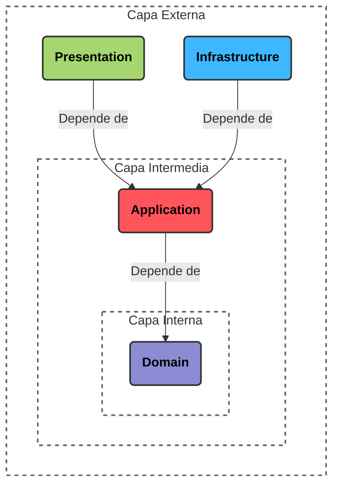

# Clean-Architecture



Clean Architecture, propuesta por Robert C. Martin (Uncle Bob), también usa capas (generalmente representadas como anillos concéntricos), pero invierte el control usando la Regla de Dependencia: El código solo puede apuntar hacia adentro. Las capas internas no deben saber absolutamente nada de las capas externas.

Esto se traduce a:

- Presentation "conoce" a Application
- Presentation "conoce" a Infraestructure
- Infraestructure "conoce" a Application
- Application "conoce" a Domain
- Domain no "conoce" a nadie

## ¿Qué es cada capa en el código?

Son diferentes proyectos (`.proj`).

Infraestructure, Application y Domain son proyectos `classlib` y Presentation es un proyecto `webapi`.

```Bash
# Crear los proyectos de las capas (Dominio, Aplicación, Infraestructura) como Class Libraries
dotnet new classlib -n NOMBREPROYECTO.Domain
dotnet new classlib -n NOMBREPROYECTO.Application
dotnet new classlib -n NOMBREPROYECTO.Infrastructure

# Crear el proyecto WebAPI
dotnet new webapi -n NOMBREPROYECTO.WebApi
```

## ¿Qué es "conoce" en el código?

Son las referencias entre los proyectos.

```Bash
# Establecer las refenrecias entre proyectos (Regla de dependencia de Clean Arch)

# WebApi (Presentation/UI) depende de Application (para usar casos de uso) e Infrastructure (para inyección de dependencias)
dotnet add src\NOMBREPROYECTO.WebApi\NOMBREPROYECTO.WebApi.csproj reference src\NOMBREPROYECTO.Application\NOMBREPROYECTO.Application.csproj src\NOMBREPROYECTO.Infrastructure\NOMBREPROYECTO.Infrastructure.csproj

# Infrastructure conoce Application 
dotnet add src\NOMBREPROYECTO.Infrastructure\NOMBREPROYECTO.Infrastructure.csproj reference src\NOMBREPROYECTO.Application\NOMBREPROYECTO.Application.csproj

# Application conoce de Domain
dotnet add src\NOMBREPROYECTO.Application\NOMBREPROYECTO.Application.csproj reference src\NOMBREPROYECTO.Domain\NOMBREPROYECTO.Domain.csproj
```

Dominio (Domain / Core): Es el centro de todo. Contiene las Entidades (los modelos de negocio fundamentales) y las reglas de negocio puras. No tiene ninguna dependencia externa. No sabe de bases de datos, ni de JSON, ni de HTTP.

Aplicación (Application): Contiene los Casos de Uso (lo que el sistema puede hacer). Aquí se define la lógica de la aplicación y las interfaces (abstracciones) para interactuar con el mundo exterior (como IUserRepository). Tampoco sabe cómo se guardan los datos.

Infraestructura (Infrastructure): Aquí es donde se implementan las interfaces definidas en la capa de Aplicación. Es donde vive el código que interactúa con Entity Framework, Dapper, clientes HTTP, o el sistema de archivos.

Presentación (Presentation / Web Api): La capa más externa. Contiene los Controladores (Controllers) que reciben las peticiones HTTP y devuelven respuestas. Su único trabajo es traducir el mundo web a parámetros que la capa de Aplicación pueda entender.

La diferencia clave: Inversión de Dependencias (SOLID)
En Clean Architecture, la capa de Casos de Uso (Aplicación) no depende de la implementación de la base de datos (Infraestructura). En su lugar, la Aplicación define una interfaz y la Infraestructura la implementa.

Esto significa que tanto la Presentación como la Infraestructura apuntan sus dependencias hacia el centro. Si mañana decides cambiar tu base de datos relacional por una base de datos NoSQL, o cambiar tu API REST por un sistema de mensajería, tu Dominio y tus Casos de Uso permanecen exactamente iguales porque nunca estuvieron acoplados a esa tecnología.
